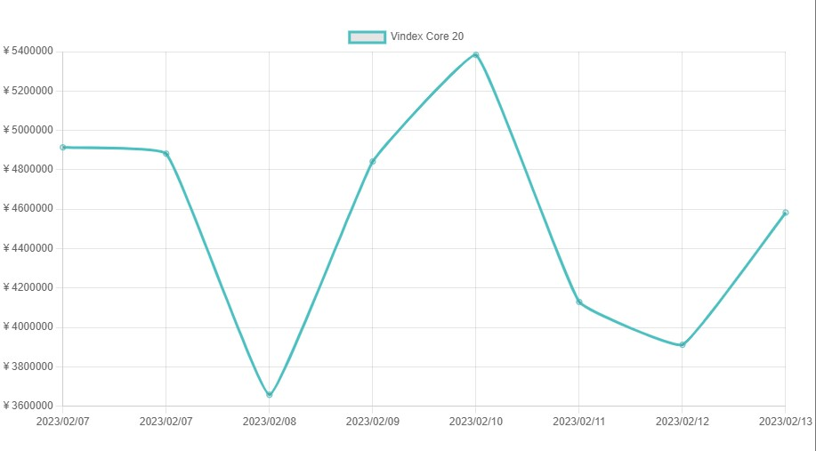
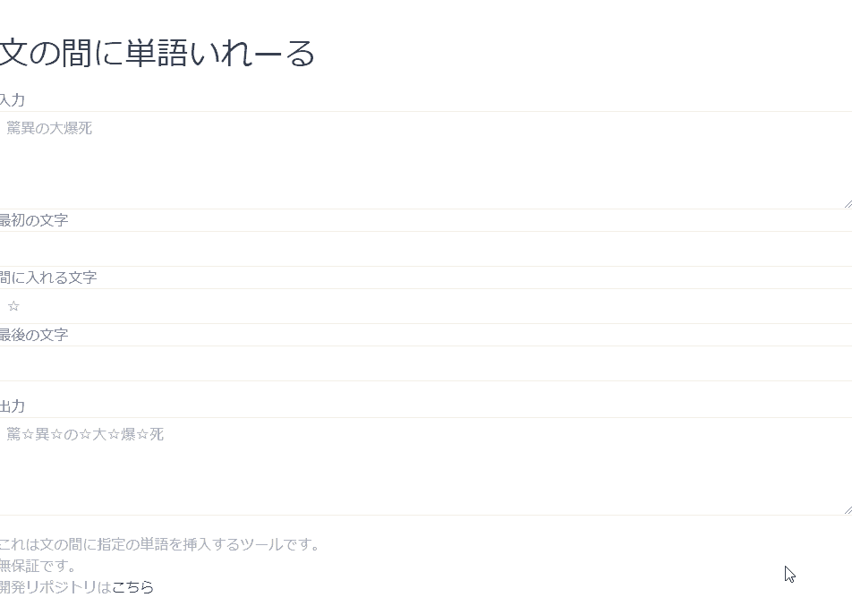

# 開発したWebサービス
## Annict-Badge    

[公開サイト](https://zenn.dev/penguincabinet/articles/762e7e201fd86a)

### 概要
Annictの記録したアニメ数をGitHubのプロフィールに載せるサービスです。   
インフラはGoogle Cloud FunctionsとGoogle Cloud Runを使用しています。    
※Annictは、アニメ視聴を記録し感想を投稿できるサービスです。    
### 設計
クエリパラメータをもとに、Annict APIでデータを取得し、それをshields.ioに投げてバッジのSVGファイルを作成し、返却しています。    
独自ドメインの関係でGoogle Cloud FunctionsからGoogle Cloud Run形式に変換し、Google Cloud Runにデプロイしています。    
### 開発に使用した言語・ライブラリ
|||
|---|---|
|Backendの使用言語・ライブラリ|Python|    
|Frontendの使用言語・ライブラリ|なし|    
### インフラ
|||
|---|---|
|Backendインフラ|Google Cloud Functions,Google Cloud Run|
|Frontendインフラ|なし|

## Vindex Core 20    

[公開サイト](https://vdex.penguincabinet.com)
### 概要
Vindex Core 20はその日の上位20名のVtuberのスパチャ総額です。Vtuber業界の盛り上がりの指標にお使いください。    
### 設計
毎日、指定時間にFaaSの関数を呼び出し、クローリングし、Google Cloud Storageに記録しています。    
そのデータをフロントエンドにJsonで返し、グラフ描画しています。グラフ描画用のライブラリはChart.jsです。    
### 開発に使用した言語・ライブラリ
|||
|---|---|
|Backendの使用言語・ライブラリ|Python|    
|Frontendの使用言語・ライブラリ|HTML,JavaScript|    
### インフラ
|||
|---|---|
|Backendインフラ|Google Cloud Functions,Google Cloud Storage|    
|Frontendインフラ|Cloudflare Pages|    

## 文の間に単語いれーる   

[公開サイト](https://iws.penguincabinet.com)    
[ソースコード](https://github.com/PenguinCabinet/insert-word-in-sentence)    
### 概要
文字の間に☆やスペースを入れるWebツールです。   
### 設計
こちらはFrontendオンリーの成果物です。    
### 開発に使用した言語・ライブラリ
|||
|---|---|
|Backendの使用言語・ライブラリ|なし|    
|Frontendの使用言語・ライブラリ|HTML,JavaScript|    
### インフラ
|||
|---|---|
|Backendインフラ|なし|    
|Frontendインフラ|Github Pages|    
